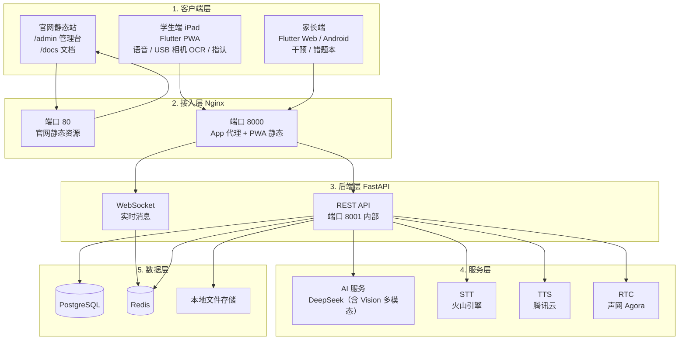
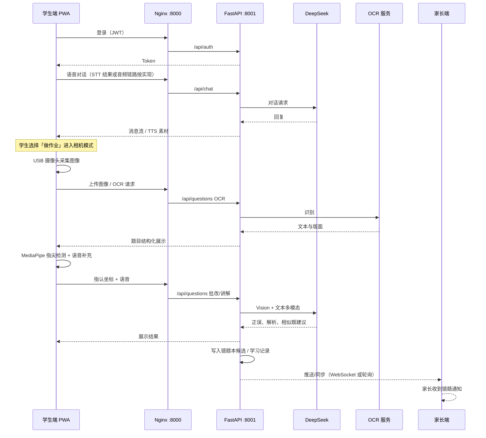
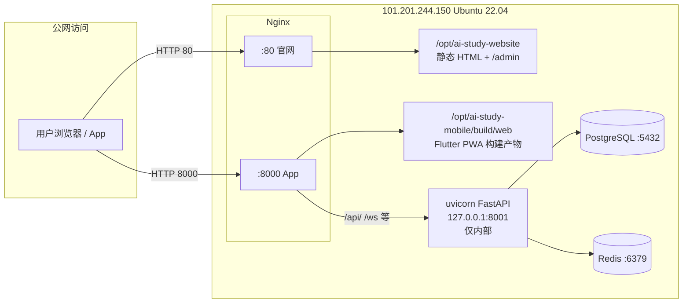

# 学习指认AI — 系统架构设计文档

**文档版本**：1.1（同步《需求文档》家长端 Android 优先、成本策略、文档托管与测试落地）  
**适用对象**：K12 学生与家长、运维与研发  
**平台名称**：学习指认AI  

---

## 1. 系统概述

「学习指认AI」是一套面向 K12 的 **语音优先、多模态交互** 的智能学习平台，通过 **USB 摄像头 OCR、题目指认（指尖/点选/框选等，见需求文档两版路径）、实时音视频与 AI 辅导** 串联「做题—纠错—讲解—错题沉淀—家长介入」闭环。  
**需求基线**：以 `doc/需求文档.md` 为准；**无端侧小模型**实现路径见 `doc/需求文档-无端侧小模型版.md`。

### 1.1 端侧构成

| 端 | 形态与入口 | 核心能力 |
|----|------------|----------|
| **学生端（iPad）** | Flutter **PWA**，经 **8000** 端口访问；可配合原生能力 | **语音优先** 与 AI 对话；USB 摄像头采集作业图像做 **OCR**；**指尖指认** 与题目区域关联；学习过程与错题同步 |
| **家长端** | **第一阶段：Flutter Android 手机 APK**（同域 **8000**）；Web 后续 | **远程教学干预**、权限与策略；**错题本** 生成、审阅、再生成；小屏适配与推送（见需求 §5.8） |
| **官网** | 静态 HTML，**80** 端口 | 品牌与产品介绍；**管理后台** `/admin`；**项目文档** 静态目录 `/docs/`（部署时由 `doc/` 同步） |
| **后端** | Python **FastAPI**，进程监听 **8001**（内网/本机，不对外直连） | REST API、WebSocket、业务编排与第三方服务集成；对外由 **Nginx（8000）** 反向代理 `/api/`、`/ws` 等 |

### 1.2 设计原则（摘要）

- **语音优先**：降低小学生输入门槛，STT/TTS 与对话服务深度集成。  
- **多模态**：图像（OCR + 视觉大模型）、语音、指认坐标统一进入题目与讲解链路。  
- **家长可介入**：在合规与权限控制下，支持远程音视频辅导，AI 退居「助教」角色。  
- **单机裸金属可部署**：systemd 托管、Nginx 统一入口，便于学校或机构私有化落地。

---

## 2. 分层架构图（Mermaid）

以下展示从客户端到数据层的逻辑分层与主要依赖关系。



**说明**：

- 学生/家长应用通过 **8000** 进入 Nginx，API 与 WebSocket 被转发至 **8001** 的 FastAPI；PWA 静态资源可由 Nginx 直接托管。  
- 官网通过 **80** 提供静态页，管理后台挂载在 **`/admin`**。  
- AI、语音、RTC 等以外部 SaaS/SDK 形式接入，由后端统一鉴权与编排。

---

## 3. 技术栈总览

| 层级 | 技术选型 | 用途说明 |
|------|----------|----------|
| 学生端 | Flutter **PWA** / 原生扩展 | iPad 浏览器或壳内访问；语音对话、相机、指认等能力按需原生增强 |
| 家长端 | Flutter **Android 原生优先**（APK），Web 后续 | 远程干预、错题本与家长权限；手机端优先保障 RTC |
| 后端 | Python **FastAPI** | 高并发 API、异步 I/O、依赖注入与 OpenAPI 文档 |
| 数据库 | **PostgreSQL** + **Redis** | 事务型业务数据；会话、缓存、限流、WebSocket 辅助状态 |
| 实时通道 | **WebSocket** | 推送、同步、部分实时交互（与 RTC 互补） |
| 音视频 | **Agora SDK** | 三方通话、家长介入、低延迟互动 |
| AI | **DeepSeek API**（含 **Vision 多模态**） | 对话、解题、视觉批改与讲解 |
| 语音识别 | **火山引擎 STT** | 学生语音转写，驱动对话与指令 |
| 语音合成 | **腾讯云 TTS** | AI 回复播报、降低阅读负担 |
| 题目指认 | **MediaPipe（端侧）** 或 **点选/框选 + 云端 Vision**（见需求主文档 / 无端侧分身文档） | 与 OCR 版面映射，确定当前题目 |
| 部署 | **裸金属** + **systemd** + **Nginx** | 进程守护、反向代理、静态与 API 统一入口 |

---

## 4. 模块划分

### 4.1 后端 API 模块（`app/api/endpoints/`）

| 模块文件 | 职责 |
|----------|------|
| `auth.py` | 认证：**注册、登录、登出、当前用户 me、修改密码** |
| `chat.py` | **AI 对话**：发消息、历史记录 |
| `initialization.py` | **学生初始化**：首次设置、档案、AI 相关配置 |
| `questions.py` | **题目链路**：OCR、指尖指认、批改、讲解、相似题、视觉批改等 |
| `error_books.py` | **错题本**：生成、列表、详情、家长**审阅通过**、**重新生成** |
| `permissions.py` | **家长权限**：查看范围、干预策略等 |
| `sync.py` | **多端同步**、**视频通话 Token**（如 Agora）签发 |
| `study_records.py` | **学习记录**：时长、行为、统计口径数据 |
| `admin.py` | **管理后台**：管理员登录、**API Key** 管理、运营统计 |
| `regions.py` | **省市区三级联动**：返回省/市/区下拉数据（内置静态数据，无需数据库） |

### 4.2 业务服务层（`app/services/`）

| 服务文件 | 职责 |
|----------|------|
| `ai_service.py` | 封装 **DeepSeek** 调用（文本与多模态视觉） |
| `chat_service.py` | **场景切换**、多轮 **对话状态与上下文** 管理 |
| `ocr_service.py` | **OCR** 流水线：图像预处理、识别结果结构化 |
| `finger_service.py` | **指尖坐标** 与题目版面/选项区域的 **映射与校验** |
| `storage_service.py` | **文件上传**、本地或挂载目录 **存储**、访问策略 |
| `agora_service.py` | **声网 Token**、频道与角色参数生成 |
| `sync_service.py` | **跨设备通知**、状态同步、与 Redis/WebSocket 协作 |

---

## 5. 数据流图（Mermaid）

### 5.1 学生学习主流程

覆盖从登录到错题推送家长的端到端路径。



### 5.2 家长介入与三方通话流程

家长在许可下加入，AI 转为辅助角色。

```mermaid
sequenceDiagram
    participant S as 学生端
    participant P as 家长端
    participant B as FastAPI
    participant RTC as Agora RTC
    participant AI as DeepSeek

    P->>B: 请求介入 / 权限校验
    B-->>P: 允许 + RTC Token（sync 相关接口）
    P->>RTC: 加入频道（画中画 PiP）

    S->>RTC: 学生进房
    P->>RTC: 家长进房
    Note over S,P,RTC: 三方：学生 / 家长 /（可选）教师端扩展

    loop 辅导过程
        P->>S: 音视频讲解（主链路）
        S->>B: 侧路文字/语音摘要（可选）
        B->>AI: 辅助提示（非主导）
        AI-->>B: 简短补充
        B-->>S: 「助教式」建议展示
    end

    Note over AI: AI 角色降级为助手，避免与家长讲解冲突
```

---

## 6. 部署架构（Mermaid）

**服务器**：`101.201.244.150`，**Ubuntu 22.04**，裸金属部署。



### 6.1 端口与路径对照

| 端口 | 组件 | 行为 |
|------|------|------|
| **80** | Nginx | 根站点 → **`/opt/ai-study-website`**（静态 HTML）；管理后台 **`/admin`** |
| **8000** | Nginx | **`/api/`**、**`/ws`** 等 → 反向代理到 **127.0.0.1:8001**；其余可托管 **PWA** → **`/opt/ai-study-mobile/build/web`** |
| **8001** | uvicorn + FastAPI | **仅本机监听**，不暴露公网 |
| **5432** | PostgreSQL | 业务库 |
| **6379** | Redis | 缓存 / 会话辅助 / 实时状态 |

### 6.2 进程与运维

- 使用 **systemd** 管理 `uvicorn`（及可选 worker），开机自启与崩溃重启。  
- **Nginx** 负责 TLS 终结（若配置证书）、gzip、静态资源缓存与 API 超时。  
- 密钥与第三方 Key 仅存在于服务器 **`.env`**，不入库明文；详见安全章节。

---

## 7. 安全设计

### 7.1 身份认证与令牌

- **JWT** 访问令牌，**有效期 48 小时**；客户端在过期前通过 **静默刷新**（如 Refresh Token 或滑动续期接口，具体以实现为准）减少打断。  
- **管理后台账号体系** 与普通 **学生/家长用户** **隔离**，避免权限提升与误用同一凭证。

### 7.2 密钥与配置

- **DeepSeek、火山、腾讯云、Agora** 等 **API Key** 存放于服务器 **`.env`**，代码与仓库中不出现明文。  
- 管理面 **`admin.py`** 中对 Key 做 **脱敏展示**（如仅显示前后若干位），支持轮换与禁用。

### 7.3 网络安全与 API

- **CORS** 按实际前端域名白名单配置，禁止 `*` 与生产环境调试域名混用。  
- Nginx 可对 `/api/` 做 **限流**、**请求体大小限制**、**超时**，防止滥用与 DoS。  
- 内网 **8001** 不对外监听；仅 **Nginx** 对外暴露 **80 / 8000**。

### 7.4 业务与隐私（K12 场景）

- 家长 **permissions** 与 **错题本审阅** 流程需与账号绑定，审计关键操作（如错题公开、导出）。  
- 学生影像、作业图片按 **storage_service** 策略存本地或合规存储，保留周期与删除策略在运维层配置。

---

## 8. 文档维护

| 项目 | 说明 |
|------|------|
| 变更记录 | 架构调整时请同步更新本文与 `需求文档.md` / `需求文档-无端侧小模型版.md` |
| 测试与部署 | 后端 `server/tests/`：`pytest`（默认排除 `integration`）；`scripts/deploy_all.py` 上传 `doc/` → 官网 `/docs/` 并在服务器执行单元测试门禁 |
| 对接清单 | 各云厂商控制台、回调域名、HTTPS 证书需与 Nginx 配置一致 |

---

*本文档描述「学习指认AI」目标架构与部署约定，实现细节以代码与 `deploy/nginx.conf`、systemd 单元为准。*
