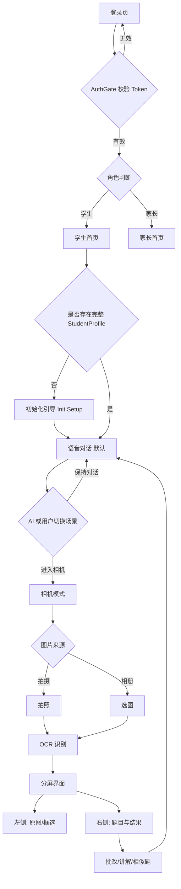
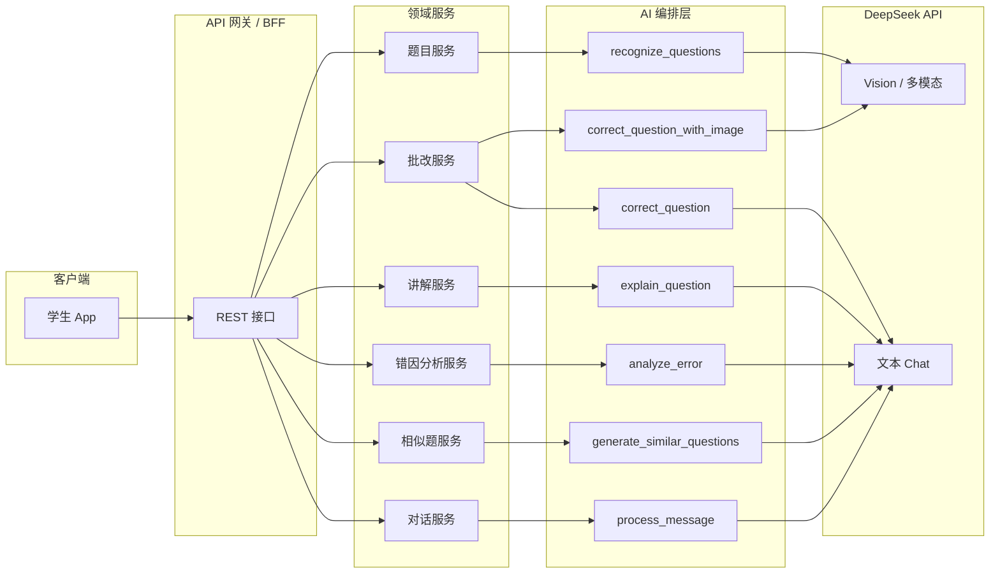

# 学习指认AI — K12 智能学习平台详细设计文档

**文档版本**：1.1  
**产品名称**：学习指认AI  
**适用范围**：后端服务、前端应用、AI 编排层、运维与合规

---

## 文档说明

本文档描述「学习指认AI」平台在数据模型、接口契约、前端交互与 AI 调用链上的详细设计，作为研发实现与联调验收的依据。文中 API 路径均以 REST 风格示例，实际部署可加统一前缀（如 `/api/v1`）。

### 与需求、架构的同步（v1.1）

- **功能与规则**以 `doc/需求文档.md` 为准；**无端侧小模型**路径以 `doc/需求文档-无端侧小模型版.md` 为准（指认、遮挡、VAD 等实现差异）。  
- **家长端**：第一阶段为 **Android 手机 APK**（Flutter），详见需求 §5.8。  
- **架构与端口**：见《架构设计文档》v1.1；官网 **80** 端口除静态页外，代理 **`/api/`** 至 FastAPI 以支撑管理后台；**`/docs/`** 托管 Markdown 需求/设计/测试文档（由部署脚本同步 `doc/`）。  
- **后端测试**：`server/tests/` + `pytest`；`DATABASE_URL=sqlite+aiosqlite:///:memory:` 用于 CI/部署门禁；生产仍为 PostgreSQL。  
- **依赖约束**：`requirements.txt` 中 **`bcrypt>=4,<5`**，与 `passlib` 兼容。

---

## 1. 数据库模型设计

### 1.1 设计原则

- **用户中心**：`users` 为身份与账号根实体；学生画像、权限、设备、学习数据均通过 `user_id` 关联。
- **会话与题目**：聊天与做题可共用 `session_id`，题目与批改、错题本条目通过外键串联，便于追溯。
- **JSON 扩展**：科目目录、知识点、统计、变更日志等使用 JSON 字段，兼顾灵活性与演进。
- **枚举约束**：设备类型、状态、题型、批改状态、错题本审批状态等建议在应用层与数据库层双重约束（CHECK 或枚举类型）。

### 1.2 实体关系说明

| 实体 | 说明 |
|------|------|
| User | 账号主体；一对多关联设备、错题本、学习记录、聊天消息、题目等 |
| StudentProfile | 学生画像，与 User 一对一（`user_id` 唯一） |
| Permission | 家长/策略控制的 AI 能力开关，与 User 一对一 |
| Device | 学生 iPad / 家长 Android 等设备与会话活跃状态 |
| ChatMessage | 按 `session_id` 聚合的对话消息 |
| Question | 单次会话中的题目序列，含 OCR、手写答案与知识点 |
| QuestionImage | 题目关联的多张图片 |
| CorrectionResult | 与题目一对一的批改结果 |
| ErrorBook | 错题本册；含审批流与统计 |
| ErrorBookItem | 错题本内条目，可关联原 `question_id` |
| StudyRecord | 通用行为审计与学习轨迹 |
| SubjectRecord | 按科目维度的结构化学习记录（可与题目流并行沉淀） |

### 1.3 ER 图（Mermaid）

```mermaid
erDiagram
    users ||--o{ devices : "拥有"
    users ||--|| student_profiles : "画像"
    users ||--|| permissions : "权限"
    users ||--o{ error_books : "错题本"
    users ||--o{ study_records : "学习记录"
    users ||--o{ chat_messages : "聊天"
    users ||--o{ questions : "题目"
    users ||--o{ correction_results : "批改(冗余user)"
    users ||--o{ subject_records : "科目记录"

    questions ||--o{ question_images : "附图"
    questions ||--|| correction_results : "批改结果"
    error_books ||--o{ error_book_items : "条目"
    questions ||--o{ error_book_items : "来源题"

    users {
        bigint id PK
        string username UK
        string hashed_password
        string nickname
        string avatar_url
        boolean is_active
        datetime created_at
        datetime updated_at
    }

    devices {
        bigint id PK
        bigint user_id FK
        enum device_type "student_ipad|parent_android"
        string device_name
        string device_token
        enum status "online|offline"
        datetime last_active_at
        datetime created_at
    }

    student_profiles {
        bigint id PK
        bigint user_id FK "UK"
        int grade
        string province "省"
        string city "市"
        string district "区"
        string region "拼接: 省 市 区"
        string ai_name "默认小智"
        string ai_voice
        string ai_speed
        json subject_catalog
        boolean auto_push_errors
        datetime created_at
        datetime updated_at
    }

    chat_messages {
        bigint id PK
        bigint user_id FK
        string session_id
        string role "user|assistant"
        text content
        string message_type "text|scene_switch|system"
        string scene "chat|camera"
        datetime created_at
    }

    questions {
        bigint id PK
        bigint user_id FK
        string session_id
        int sequence_no
        enum subject
        enum question_type "choice|fill_blank|calculation|application|short_answer|other"
        text question_text
        text student_answer
        text correct_answer
        text ocr_raw_text
        string image_url
        json region_bbox
        json knowledge_points
        int difficulty
        datetime created_at
    }

    question_images {
        bigint id PK
        bigint question_id FK
        string image_url
        string image_type
        datetime created_at
    }

    correction_results {
        bigint id PK
        bigint question_id FK "UK"
        bigint user_id FK
        enum status "pending|correct|incorrect|partial"
        boolean is_correct
        decimal score
        text standard_answer
        text solution_steps
        text explanation
        enum error_reason "calculation_error|misread_question|concept_confusion|formula_error|missing_steps|logic_error|other"
        text error_analysis
        json knowledge_points
        json similar_question_ids
        float ai_confidence
        boolean manually_corrected
        datetime created_at
        datetime updated_at
    }

    error_books {
        bigint id PK
        bigint user_id FK
        string title
        string subject
        enum approval_status "draft|pending_approval|approved|rejected|regenerating"
        text rejection_reason
        datetime approved_at
        bigint approved_by
        int total_questions
        json statistics
        datetime created_at
        datetime updated_at
    }

    error_book_items {
        bigint id PK
        bigint error_book_id FK
        bigint question_id FK
        string original_image_url
        text question_text
        text student_answer
        text correct_answer
        text error_analysis
        json knowledge_tags
        json similar_questions
        datetime created_at
    }

    permissions {
        bigint id PK
        bigint user_id FK "UK"
        boolean ai_answer_enabled
        boolean ai_explanation_enabled
        boolean ai_similar_questions_enabled
        json change_log
        datetime updated_at
    }

    study_records {
        bigint id PK
        bigint user_id FK
        string session_id
        string action_type
        string action_detail
        json metadata_json
        datetime created_at
    }

    subject_records {
        bigint id PK
        bigint user_id FK
        string subject
        string chapter
        string knowledge_point
        text question_text
        text student_answer
        text correct_answer
        boolean is_correct
        string error_reason
        string image_url
        json extra_data
        date record_date
        datetime created_at
    }
```

### 1.4 索引与约束建议

- `users.username`：唯一索引。
- `student_profiles.user_id`、`permissions.user_id`、`correction_results.question_id`：唯一约束。
- `chat_messages (user_id, session_id, created_at)`、`questions (user_id, session_id, sequence_no)`：复合索引，利于历史拉取与题目排序。
- `devices (user_id, device_token)`：按需唯一或普通索引，支持推送与在线状态查询。
- `study_records (user_id, created_at DESC)`：列表分页。
- `error_books (user_id, approval_status, updated_at)`：家长端审批列表。

---

## 2. 完整 API 接口列表

**通用约定**

- **鉴权**：除注册、登录、健康检查及部分 Admin 登录外，请求头携带 `Authorization: Bearer <access_token>`。
- **Content-Type**：JSON 体使用 `application/json`；上传图片使用 `multipart/form-data`。
- **响应**：统一包装建议 `{ "code", "message", "data" }`；分页建议 `{ "items", "total", "page", "page_size" }`。

### 2.1 认证 Auth

| 方法 | 路径 | 需登录 | 请求摘要 | 响应摘要 |
|------|------|--------|----------|----------|
| POST | `/auth/register` | 否 | `username`, `password`, `nickname?`, `role?`（学生/家长） | `user` 概要、`tokens` |
| POST | `/auth/login` | 否 | `username`, `password`, `device_type?`, `device_token?` | `access_token`, `refresh_token`, `user` |
| POST | `/auth/logout` | 是 | 可选 `refresh_token` | 成功消息 |
| GET | `/auth/me` | 是 | 无 body | 当前用户完整信息（含 profile 摘要） |
| PUT | `/auth/change-password` | 是 | `old_password`, `new_password` | 成功消息 |

### 2.2 对话 Chat

| 方法 | 路径 | 需登录 | 请求摘要 | 响应摘要 |
|------|------|--------|----------|----------|
| POST | `/chat/message` | 是 | `session_id?`, `content`, `message_type?`, `scene?` | `message`（assistant 回复）、`session_id`、`scene_switch?` |
| GET | `/chat/history/{session_id}` | 是 | 查询参数：`before_id?`, `limit?` | 消息列表（时间正序或倒序约定） |

### 2.3 初始化 Init

| 方法 | 路径 | 需登录 | 请求摘要 | 响应摘要 |
|------|------|--------|----------|----------|
| POST | `/init/setup` | 是 | `grade`, `province`, `city`, `district`, `ai_name?`, `ai_voice?`, `ai_speed?` | `student_profile`（含拼接 `region`） |
| GET | `/init/profile` | 是 | 无 | 当前用户 `student_profiles` 全量 |
| PUT | `/init/ai-config` | 是 | `ai_name`, `ai_voice`, `ai_speed` 等部分字段 | 更新后的 profile |

### 2.3b 省市区 Regions（无需登录）

| 方法 | 路径 | 需登录 | 请求摘要 | 响应摘要 |
|------|------|--------|----------|----------|
| GET | `/regions/provinces` | 否 | 无 | 省级行政区名称列表 `string[]` |
| GET | `/regions/cities` | 否 | `province`（Query） | 该省地级市名称列表 `string[]` |
| GET | `/regions/districts` | 否 | `province`, `city`（Query） | 该市区县名称列表 `string[]` |

### 2.4 题目 Questions

| 方法 | 路径 | 需登录 | 请求摘要 | 响应摘要 |
|------|------|--------|----------|----------|
| POST | `/questions/ocr` | 是 | `image` 或 `image_url`, `session_id?` | OCR 文本、`questions` 草稿列表、`region_bbox` |
| POST | `/questions/finger-point` | 是 | `image`, `x`, `y` 或 bbox，`session_id?` | 局部裁剪 URL、识别出的 `question` 片段 |
| POST | `/questions/create` | 是 | `session_id`, `question_text`, `question_type`, `subject`, `student_answer?`, `image_urls?`, `knowledge_points?` | 创建的 `question` |
| GET | `/questions/session/{id}` | 是 | 可选 `sequence_order` | 该会话下题目列表 |
| POST | `/questions/{id}/correct` | 是 | 可选强制 `mode=text` | `correction_result`（状态、得分、标准答案等） |
| POST | `/questions/{id}/explain` | 是 | 可选 `detail_level?` | `explanation`, `solution_steps` |
| POST | `/questions/{id}/similar` | 是 | `count?` | `similar_questions[]` |
| POST | `/questions/vision-correct` | 是 | `question_id` 或 inline `image`+题干 | 视觉批改 `correction_result` |
| POST | `/questions/upload-image` | 是 | `multipart` 文件 | `image_url`, `width`, `height` |

### 2.5 错题本 Error Books

| 方法 | 路径 | 需登录 | 请求摘要 | 响应摘要 |
|------|------|--------|----------|----------|
| POST | `/error-books/generate` | 是 | `title?`, `subject?`, `question_ids?` 或时间范围 | 新建 `error_book`（`approval_status` 初始可为 draft/pending） |
| GET | `/error-books/list` | 是 | `status?`, `page`, `page_size` | 错题本列表 |
| GET | `/error-books/{id}` | 是 | 无 | 错题本详情含 `items[]` |
| POST | `/error-books/{id}/approve` | 是（家长/管理员） | `action`: approve/reject, `rejection_reason?` | 更新后 `error_book` |
| POST | `/error-books/{id}/regenerate` | 是 | 可选参数覆盖统计维度 | 异步任务 id 或新状态 `regenerating` |
| PUT | `/error-books/{id}/items` | 是 | `items[]` 增删改（id、排序、备注） | 更新后的条目列表 |

### 2.6 权限 Permissions

| 方法 | 路径 | 需登录 | 请求摘要 | 响应摘要 |
|------|------|--------|----------|----------|
| GET | `/permissions` | 是 | 无 | 当前用户（或家长代管学生）的 `permissions` |
| PUT | `/permissions` | 是（家长） | `ai_answer_enabled`, `ai_explanation_enabled`, `ai_similar_questions_enabled` | 更新后实体，`change_log` 追加 |

### 2.7 同步 Sync

| 方法 | 路径 | 需登录 | 请求摘要 | 响应摘要 |
|------|------|--------|----------|----------|
| GET | `/sync/device-status` | 是 | 可选 `user_id`（家长查孩子） | 各 `device` 在线状态、`last_active_at` |
| POST | `/sync/video-call-token` | 是 | `channel_name?`, `target_user_id?` | 第三方 RTC `token`, `expire_at` |

### 2.8 学习记录 Study Records

| 方法 | 路径 | 需登录 | 请求摘要 | 响应摘要 |
|------|------|--------|----------|----------|
| GET | `/study-records/list` | 是 | `action_type?`, `from`, `to`, `page` | `study_records[]` |
| GET | `/study-records/session/{id}` | 是 | 无 | 该 `session_id` 下所有行为记录 |

### 2.9 管理端 Admin

| 方法 | 路径 | 需登录 | 请求摘要 | 响应摘要 |
|------|------|--------|----------|----------|
| POST | `/admin/login` | 否 | `admin_username`, `password`, `otp?` | `admin_token` |
| GET | `/admin/api-keys` | 是（管理员） | 无 | 脱敏后的密钥列表、用途、创建时间 |
| PUT | `/admin/api-keys` | 是（管理员） | `deepseek_key?`, `rtc_key?` 等 | 更新结果 |
| GET | `/admin/stats` | 是（管理员） | `range?` | DAU、题目量、批改量、错题本生成量等 |

### 2.10 健康检查 Health

| 方法 | 路径 | 需登录 | 请求摘要 | 响应摘要 |
|------|------|--------|----------|----------|
| GET | `/health` | 否 | 无 | `status: ok`, `version`, 依赖检查（DB/Redis/AI） |

---

## 3. 前端页面交互流程

### 3.1 流程说明

1. **登录**：用户完成账号认证后进入 **AuthGate**（路由守卫），校验 token 与角色。
2. **分流**：根据角色进入 **学生端首页** 或 **家长端首页**（设备类型可与 `device_type` 对齐展示能力）。
3. **学生初始化**：若无 `student_profiles` 或关键字段缺失，强制进入 **初始化引导**（年级、地区、科目、AI 昵称与音色等）。
4. **默认语音对话**：主界面为 **语音/文字对话**；AI 可通过 `message_type=scene_switch` 建议切换场景。
5. **相机模式**：由 AI 触发或学生主动进入；支持 **拍摄/相册** → **OCR 识别** → **分屏**：左侧原图/批注，右侧结构化结果（题目列表、批改、讲解入口）。

### 3.2 流程图（Mermaid）

---

## 4. AI 服务调用链（DeepSeek）

### 4.1 总体说明

平台将 **DeepSeek** 作为核心大模型能力（含多模态/视觉能力，具体以所选模型端点为准：如文本模型 + 视觉模型）。业务服务层封装以下能力函数，统一处理：提示词模板、用户权限校验、`permissions` 开关、流式输出（对话）、超时与重试、审计日志写入 `study_records`。

### 4.2 能力函数与 DeepSeek 用法

| 能力函数 | 典型 DeepSeek 用法 | 输入要点 | 输出要点 |
|----------|-------------------|----------|----------|
| `recognize_questions` | **Vision + OCR 结构化解析**（图像输入 + JSON Schema 约束提示） | 题目图片 URL/base64；可选学科、年级 | 题干列表、`region_bbox`、初步 `question_type`、原始 OCR 文本 |
| `correct_question` | **纯文本批改**（chat/completions） | `question_text`, `student_answer`, `correct_answer?`, 评分标准 | `is_correct`, `score`, `standard_answer`, `solution_steps`, `status` |
| `correct_question_with_image` | **视觉批改**（vision 模型） | 手写答案图 + 题干文本 | 同上，附加对书写/步骤的视觉判断 |
| `explain_question` | **讲解生成**（文本模型） | 题干、正确答案、学生错答、知识点 | `explanation`, 分步 `solution_steps` |
| `analyze_error` | **错因分析**（文本模型） | 题目、学生答案、知识点、可选历史错题 | `error_reason` 枚举映射、`error_analysis`、`knowledge_points` |
| `generate_similar_questions` | **相似题生成**（文本模型） | 原题、知识点、难度、数量 | 相似题文本/结构列表，IDs 入库后回填 |
| `chat process_message` | **对话 + 场景检测**（文本模型，可多轮） | 当前消息、历史摘要、`scene` 状态 | 回复文本；必要时输出结构化 `scene_switch` → 前端切相机 |

### 4.3 调用链示意图（Mermaid）

### 4.4 典型端到端链路（示例）

1. **拍照搜题**：`POST /questions/upload-image` → `recognize_questions`（DeepSeek Vision）→ 写入 `questions`、`question_images` → 返回分屏数据。
2. **指认小题**：`POST /questions/finger-point` → 裁剪后再次调用 `recognize_questions` 或轻量检测模型 → 更新 `region_bbox`。
3. **自动批改**：`POST /questions/{id}/correct` → 若有图且策略为视觉 → `correct_question_with_image`，否则 `correct_question` → 持久化 `correction_results`。
4. **讲解与错题**：`explain_question` / `analyze_error` 受 `permissions` 控制；通过后写入并可触发 `error_books` 生成流水线。
5. **对话切场景**：`process_message` 在回复中附带场景信号，客户端解析后进入相机流程，并写入 `chat_messages.message_type=scene_switch`。

### 4.5 非功能性要求（AI 侧）

- **密钥管理**：DeepSeek Key 仅存服务端，通过 `admin/api-keys` 配置，禁止下发客户端。
- **限流与降级**：模型超时返回友好提示，批改可标记 `pending` 异步重试。
- **合规**：K12 场景需注意内容安全与未成年人保护，建议增加输入输出审核（可与 AI 编排同层实现）。

---

## 附录：文档修订记录

| 版本 | 日期 | 说明 |
|------|------|------|
| 1.0 | 2026-04-01 | 初稿：库表、API、前端流程、DeepSeek 调用链 |

---

*本文档由产品设计/架构评审后持续迭代，与实现代码不一致时以已发布接口契约与迁移脚本为准。*
